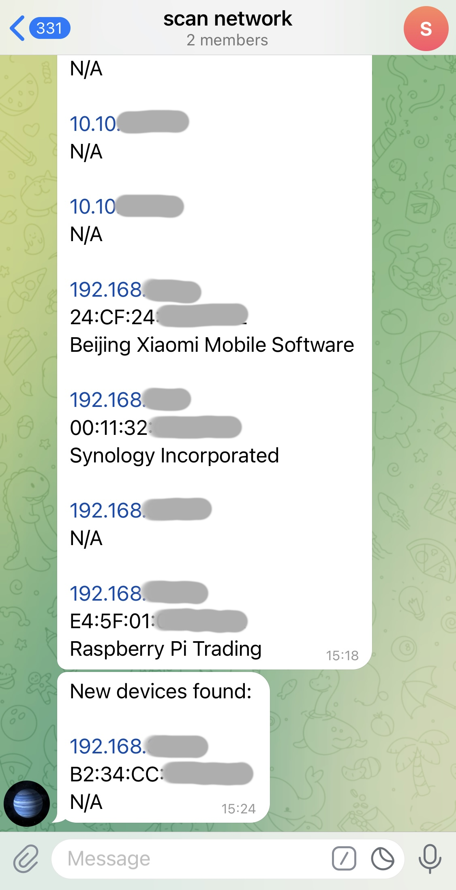

## Loop Network Scanner

This script is designed to monitor devices on a network. It periodically scans specified IP ranges and notifies you if any new devices appear. Notifications can be sent to both a log file and Telegram.

## Installing the required dependencies

We [install Nmap](https://nmap.org/download), then configure the system:

```
$ git clone https://github.com/soko1/loop-network-scanner 
$ cd loop-network-scanner
$ mv loop-network-scanner.conf.sample loop-network-scanner.conf
$ virtualenv env
$ source ./env/bin/activate
(env) $ pip install -r requirements.txt
```

## Configuration

The configuration file `loop-network-scanner.conf` contains the following parameters:

```
DATABASE_FILE=loop-network-scanner.db
LOG_FILE=loop-network-scanner.log
IP_RANGES=10.10.11.0/24,192.168.31.0/24
SCAN_INTERVAL_IN_SECONDS=90

### telegram
SEND_TELEGRAM_MESSAGES=False
TELEGRAM_TOKEN=__PASTE_TOKEN__
CHAT_ID=__PASTE_CHAT_ID__
```

### Parameter Descriptions

- **DATABASE_FILE**: The name of the file where information about found devices will be stored. 

- **LOG_FILE**: The name of the file for logging. The script will log notifications about new devices. 

- **IP_RANGES**: The IP address ranges that the script will scan. Specify them as a comma-separated list. 

- **SCAN_INTERVAL_IN_SECONDS**: The interval in seconds between network scans. Set this value according to your requirements. 

### Telegram

- **SEND_TELEGRAM_MESSAGES**: Set this to `True` if you want to receive notifications on Telegram. Default is `False`.

- **TELEGRAM_TOKEN**: Your Telegram bot token. Replace `__PASTE_TOKEN__` with your bot's token.

- **CHAT_ID**: The chat ID where the bot will send messages. Replace `__PASTE_CHAT_ID__` with your chat ID.

## Running the script

The script can be run as a regular user:

```
(env) $ ./loop-network-scanner.py
```

But it is better to run it under root:

```
(env) $ sudo ./loop-network-scanner.py
```

Under root, more accurate information will be collected (for example, MAC addresses of devices will be available)

